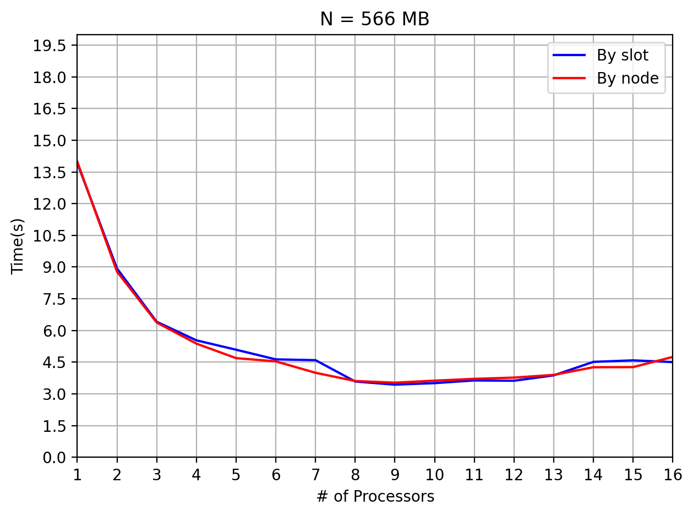
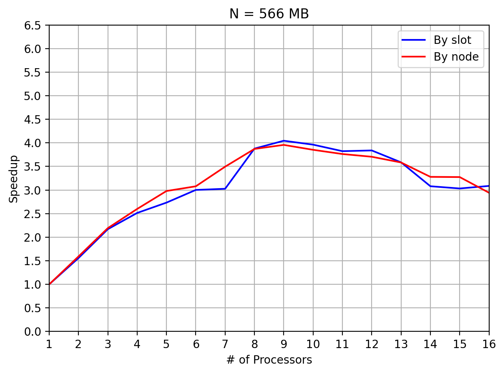
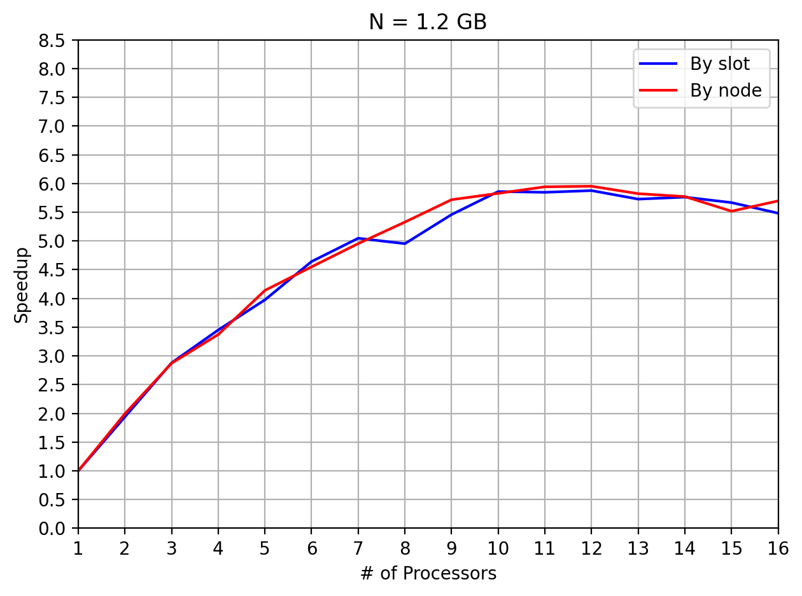
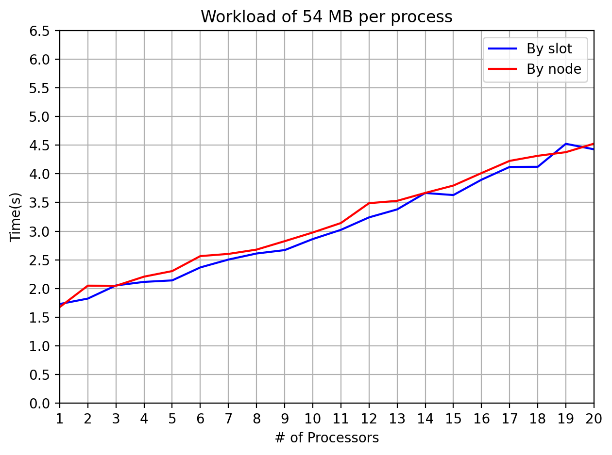

<!-- Title -->

# WORD COUNT
|**Word count**|**Bruno Roberto**| 
|---|---|
<br>

<!-- TABLE OF CONTENTS -->

<details open="open">
  <summary><h1 style="display: inline-block">Table of Contents</h1></summary>
  <ol>
    <li>
      <a href="#descrizione-del-problema">Descrizione del problema</a>
    </li>
    <li>
      <a href="#soluzione-proposta">Soluzione proposta</a>
      <ul>
         <li><a href="#breve-descrizione">Breve descrizione</a></li>
         <li><a href="#descrizione-della-soluzione-proposta">Descrizione della soluzione proposta</a></li>
      </ul>
    </li>
    <li>
      <a href="#correttezza-della-soluzione-proposta">Correttezza della soluzione proposta</a>
    </li>
    <li><a href="#utilizzo">Utilizzo</a></li>
    <li><a href="#note-sullimplementazione">Note sull'implementazione</a></li>
    <li><a href="#benchmark">Benchmark</a>
      <ul>
        <li><a href="#scalabilità-forte">Scalabilità forte</a></li>
        <li><a href="#scalabilità-debole">Scalabilità debole</a></li>
        <li><a href="#descrizione-dei-risultati">Descrizione dei risultati</a></li>
      </ul>
    </li>
    <li><a href="#conclusioni">Conclusioni</a></li>
    <li><a href="#license">License</a></li>
  </ol>
</details>

<br>

<!-- DESCRIZIONE DEL PROBLEMA -->

# **Descrizione del problema**
**Word count** è un "semplice" problema che consiste nel conteggio del numero di parole presenti in un documento o una porzione di testo.\
Il conteggio delle parole è richiesto in molte applicazioni pratiche che spaziano dal giornalismo, alle procedure legali, agli annunci pubblicitari e molto altro. Proprio per tale motivo la mole di dati da dover processare può facilmente e velocemente diventare "molto" grande e ciò ci conduce alla necessità di un approccio distribuito.\
Il seguente progetto propone, dunque, una semplice versione distribuita di Word count mediante l'uso di MPI.

<!-- SOLUZIONE PROPOSTA -->

# **Soluzione proposta**

## **Breve descrizione**
Brevemente la risoluzione del problema, seguendo il modello MASTER-SLAVE, avviene mediante tre step principali: divisione del carico, parsing parallelo dell'input e raccolta finale dei risultati.\
Il primo step, la divisione del carico ad opera del MASTER, consiste nella semplice distribuzione dei file ai vari processi SLAVE in base al loro "contenuto" (ovvero alla loro dimensione, tale aspetto è approfondito successivamente). In seguito, una volta che ogni processo ha a disposizione la propria sezione di input, inizia il secondo step relativo alla computazione parallela. Ogni nodo, dunque, effettua il conteggio delle parole mediante l'uso di una propria Hash Table locale. Infine, completata la computazione arriva il terzo e ultimo step, la raccolta dei risultati, nel quale ogni nodo invia il contenuto della propria table al MASTER che ne esegue il merge e si occupa di produrre il file csv finale contenente la lista delle parole con relativa frequenza.


## **Descrizione della soluzione proposta**
Andiamo a descrivere più in dettaglio la soluzione proposta per la risoluzione di Word count evidenziando le problematiche riscontrate ed esponendo quali sono state le scelte implementative. 
</br>
</br>
Innanzitutto la prima problematica affrontata è stata quella della distribuzione del carico di lavoro tra i processi coinvolti nella computazione.\
Seguendo la traccia del problema il nodo MASTER deve suddividere i file da processare tra i vari nodi. Tale suddivisione non può essere condotta basandosi solo sul numero dei file, altrimenti risulterebbe non omogenea.\
Bisogna, dunque, tener conto del contenuto di ciascun file, e ci sono due possibili approcci per dare un peso ai file:
- usare il numero di parole contenute nel file
- usare la dimensione del file in bytes

Tra i due si è scelto il secondo, principalmente per evitare un conteggio preventivo delle parole da parte del nodo MASTER. Infatti, il MASTER nel secondo caso non ha bisogno di fare una lettura preventiva, ma può definire la partitioning usando semplicemente i metadati dei file presenti nella directory.\
Per mantenere le informazioni relative ai file letti e alla "sezione" di input assegnata a ciascuno dei processi sono state utilizzate due struct con relativa creazione dei `MPI_Datatype` associati per l'invio mediante Scatter.


Di seguito è riportata la definizione delle struct usate e l'inizializzazione della comunicazione con la creazione dei tipi di dato derivato:

```c
/* Contains the required info for describing a file*/
typedef struct {
    char filename[FILENAME_SIZE];
    off_t size_in_bytes;
} FileInfo;

/* The info required from a process to know its section of data */
typedef struct {
    off_t start_offset;
    off_t end_offset;
    int numfiles;
} ProcessIndex;
```

```c
int main(int argc, char **argv) {
    // All processes
    int rank, numtasks, send_tag = 1, count_tag = 2, rc;
    int indegree = 1, outdegree = 1, *dest, *src, oldmaster = MASTER, master;
    double start, end;
    off_t batch_size, total_size, remainder;
    MPI_Datatype process_data, file_info;
    MPI_Aint extent, lb;
    int blocklengths[3];
    MPI_Datatype types[3];
    MPI_Aint displacements[3];
    ProcessIndex pindex;
    MapEntry *local_map = NULL;
    MPI_Group graph_group, world_group;
    MPI_Comm graph_comm;

    // Master only
    FileInfo *files;
    ProcessIndex *pindexes;
    int *send_counts, *displs;
    MapEntry *master_map = NULL;

    if(argc != 2) {
        fprintf(stderr, "Error : you have to pass a directory path\n");

        return EXIT_FAILURE;
    }

    // MPI init
    MPI_Init(&argc, &argv);

    // ProcessIndex struct type
    MPI_Type_get_extent(MPI_INT64_T, &lb, &extent);
    
    blocklengths[0] = 1;
    types[0] = MPI_INT64_T;
    displacements[0] = 0;

    blocklengths[1] = 1;
    types[1] = MPI_INT64_T;
    displacements[1] = blocklengths[0] * extent;

    blocklengths[2] = 1;
    types[2] = MPI_INT;
    displacements[2] = displacements[1] + blocklengths[1] * extent;

    MPI_Type_create_struct(3, blocklengths, displacements, types, &process_data);
    MPI_Type_commit(&process_data);

    // FileInfo struct
    MPI_Type_get_extent(MPI_CHAR, &lb, &extent);
    blocklengths[0] = FILENAME_SIZE;
    types[0] = MPI_CHAR;
    displacements[0] = 0;

    blocklengths[1] = 1;
    types[1] = MPI_INT64_T;
    displacements[1] = blocklengths[0] * extent;

    MPI_Type_create_struct(2, blocklengths, displacements, types, &file_info);
    MPI_Type_commit(&file_info);

    // Comm info
    MPI_Comm_size(MPI_COMM_WORLD, &numtasks);
    MPI_Comm_rank(MPI_COMM_WORLD, &rank);
    
    // Graph topology construction
    if(rank == MASTER) {
        indegree = numtasks - 1;
        src = malloc(sizeof(int) * indegree);
        outdegree = numtasks - 1;
        dest = malloc(sizeof(int) * outdegree);
        for(int i = 0, j = 0; i < numtasks; i++)
            if(i != rank) {
                src[j] = i;
                dest[j++] = i;
            }
    } else {
        src = malloc(sizeof(int));
        *src = MASTER;
        dest = malloc(sizeof(int));
        *dest = MASTER;
    }
    
    if((rc = MPI_Dist_graph_create_adjacent(
        MPI_COMM_WORLD, 
        indegree, 
        src, 
        MPI_UNWEIGHTED, outdegree, 
        dest, 
        MPI_UNWEIGHTED, 
        MPI_INFO_NULL, 
        1, 
        &graph_comm
        )) != MPI_SUCCESS
    )
        return rc;
        
    free(src);
    free(dest);
```

Come visibile dallo snippet precedente, oltre alla creazione dei _MPI_Datatype_, si è scelto di creare anche un nuovo _Communicator_ con una topologia a grafo per riordinare i nodi in maniera da ottimizzare la comunicazione. La topologia scelta rispecchia banalmente la comunicazione MASTER-SLAVE tra i nodi ponendo al centro del grafo il MASTER.

Lo snippet seguente mostra, invece, la funzione utilizzata per effettuare il partitioning dei file. Come è visibile, per ognuno dei processi, MASTER incluso, viene calcolato il numero di file che dovrà processare, l'offset da cui dovrà partire nel primo file e l'offset dopo il quale dovrà fermarsi nell'ultimo file. In tal modo è chiaro come ad ogni processo venga assicurata la stessa quantità di dati da processare, realizzando una distribuzione equa del lavoro.

```c
/**
 * @brief Splits up the files between the numtasks processors
 * 
 * @param numtasks the number of processors and size od the offsets, displs and pindexes arrays
 * @param send_counts an array of size 'numtasks', which will contain the number of file assigned to processors
 * @param displs an array of size 'numtasks', which will contain the displacements of processors respect to files
 * @param pindexes an array of size 'numtasks', which will contain the required info for every process
 * @param total_size the total size of files in bytes used to compute batch size. Every processor will be given at least total_size/numtasks bytes
 * @param filenum the size of the files array 
 * @param files an array of size 'filenum' 
 */
void file_scheduling(
    int numtasks, 
    int *send_counts, 
    int *displs, 
    ProcessIndex *pindexes,
    int total_size, 
    int numfiles, 
    FileInfo *files
) {
    int batch_size = total_size / numtasks;
    int remainder = total_size % batch_size;
    off_t next = 0;
    off_t nextfile_size = files[0].size_in_bytes;

    // Files'schedulation
    for(int i = 0, j = 0; i < numtasks; i++) { // i - processes index, j - files index
        pindexes[i].start_offset = next;  // Process i beginning offset
        displs[i] = j;                    // Process i beginning file
        send_counts[i] = 0;
        int mybatch = batch_size + ((remainder > i));   // Bytes of process i
        
        while(j < numfiles && mybatch > 0) {
            send_counts[i] += 1;            // Assigns the file j to processor i
            
            if(mybatch <= nextfile_size) {
                // The position in which I've stopped in the last file       
                pindexes[i].end_offset = files[j].size_in_bytes - nextfile_size + mybatch;
                // Starting offset for the next processor  
                next = (mybatch == nextfile_size) ? 0 : pindexes[i].end_offset + 1;       
                nextfile_size -= mybatch;
                // We don't need to procede to next file
                if(nextfile_size != 0) {
                    break;
                }
                mybatch = 0;    // To exit from the cycle
            }
            
            mybatch -= nextfile_size;
            j += 1; // Pass to next file
            if(j < numfiles)
                nextfile_size = files[j].size_in_bytes; //Next file's size
        }
        pindexes[i].numfiles = send_counts[i];
    }
}

```
Una volta effettuato il partitioning, ovviamente il MASTER necessita di comunicare ad ogni processo la lista dei file assegnatigli e la "sezione" di input su cui dovrà lavorare. Per realizzare ciò, non potendo un processo conoscere a priori la lunghezza della lista di file che gli verrà inoltrata dal MASTER, è stato necessario eseguire due step:
1. una prima comunicazione per fornire ad ogni processo il numero di file che riceverà e gli offset di partenza e fine computazione
2. una seconda comunicazione per poter inviare ad ogni processo la lista dei nomi dei file che dovrà processare

Tale comunicazione, come visibile nello snippet seguente, è stata realizzata attraverso due semplici comunicazioni collettive scatter, usando come tipi di dati quelli definiti precedentemente per le struct.

```c
    // Processes indexes 
    if((rc = MPI_Scatter(pindexes, 1, process_data, &pindex, 1, process_data, master, graph_comm)) != MPI_SUCCESS)
        return rc;
    
    FileInfo *recvfiles = malloc(sizeof(FileInfo) * pindex.numfiles);
    
    // Files info
    if((rc = MPI_Scatterv(
        files, 
        send_counts, 
        displs, 
        file_info, 
        recvfiles, 
        pindex.numfiles, 
        file_info, 
        master, 
        graph_comm
        )) != MPI_SUCCESS
    )
        return rc;
    
    // Deallocation
    if(rank == master) {
        free(files);
        free(send_counts);
        free(displs);
        free(pindexes);
    }
```
Come detto in precedenza, l'obbligo di effettuare due comunicazioni (operazioni "costose") è dovuto all'impossibilità da parte del nodo ricevente di poter conoscere a priori la dimensione della lista dei nomi di file che gli sarà recapitata. Tale scelta, però, sarebbe facilmente evitabile supponendo che i file della directory siano posti nello stesso identico ordine per tutti i processi. In tal caso, infatti, sarebbe sufficiente una sola comunicazione. Nonostante ciò, la scelta finale è ricaduta sulla prima implementazione (più costosa) per avere una maggiore generalità a discapito ovviamente di una comunicazione in più.

A questo punto ogni processo possiede tutti i dati necessari a portare avanti il suo task, ovvero effettuare il conteggio delle parole sulla porzione di dati assegnatagli, e può iniziare dunque la computazione parallela.\
Tale computazione è realizzata facendo sì che ogni processo legga ad uno ad uno i file assegnatigli, eseguendo se necessario una _seek_ per posizionarsi correttamente. L'identificazione delle parole durante la lettura del file è semplicemente implementata mediante lo scorrimmento carattere per carattere del buffer di appoggio usato per la lettura stessa. Di seguito uno snippet di codice contenente la funzione usata per la computazione.

```c
/**
 * @brief Reads all words in the section of data passed and puts them in the hash
 * 
 * @param files list of file to read
 * @param num_files the number of files
 * @param start_offset the starting offset of the fist file
 * @param end_offset the ending offset of the last file
 * @param map the hash
 * @param dir_path the dir path in which files are stored
 * @param rank (Used for debugging)
 * @return int 0 if is all okay, non-zero number otherwise
 */
int compute(
    FileInfo *files, 
    int num_files, 
    long start_offset, 
    long end_offset, 
    MapEntry **map, 
    char *dir_path, 
    int rank
) {
    FILE *fp;
    char filename[FILENAME_SIZE];
    char readbuf[READ_BUF] = {'\0'};
    long offset = start_offset, rd = 0;

    // Foreach file
    for(int i = 0; i < num_files; i++) {
        // Filename construction
        filename[0] = '\0';
        strcat(filename, dir_path);
        strcat(filename,"/");
        strcat(filename, files[i].filename);

        // File open
        if((fp = fopen(filename, "r")) == NULL) {
            fprintf(stderr, "Error: fopen error on file %s\n", filename);
            
            return EXIT_FAILURE;
        }

        if(fseek(fp, offset > 0 ? offset - 1 : offset, SEEK_SET) != 0) {
            fprintf(stderr, "Error: fseek error on file %s\n", filename);
            
            return EXIT_FAILURE;
        }

        char current_word[WORD_SIZE] = {'\0'};
        int current_word_size = 0, jump = 0;
        
        // First reading out of the loop 
        char *p = fgets(readbuf, READ_BUF, fp);
    
        // To handle conflicts on word between processes
        if(p != NULL && i == 0 && offset > 0) {  
            rd -= 1;
            
            // Skips whitespaces and the word shared by the two processes, if exists
            // checks also if it's a character UTF-8 with more bytes or a symbol
            while((p - readbuf) < READ_BUF && (isalpha(*p) || *p < 0 || issymbol(*p))) { 
                p += 1;
                rd += 1;
            }
            
            // To set the correct rd and p value
            if(rd < 0) {    
                rd = 0;
                p += 1;
            }
        }

        // File's reading
        while(p != NULL && !jump) {  // jump is a boolean variable to skip the loop  
            // Reading from the buffer
            for(; *p && p < readbuf + READ_BUF; p++) {
                rd += 1;
                
                if(isalpha(*p)) {   // One byte char
                    current_word[current_word_size++] = tolower(*p); 
                } else if(*p < 0) { // Multi byte char
                    int len = num_of_bytes_UTF8(*p);
                    // checks current_word buffer overflow 
                    if(current_word_size + len < WORD_SIZE - 1) {
                        char ch[len + 1];
                        for(int j = 0; j < len; j++) {
                            ch[j] = *(p + j);
                            current_word[current_word_size++] = tolower(*(p + j));
                        }
                        ch[len] = '\0';

                        // If it's a symbol, it can be skipped
                        if(ismulticharsymbol(ch)) {
                            current_word_size -= len;
                        }

                        p += (len - 1);
                        rd += (len - 1); // Remember to update rd variable
                    } else {
                        p -= 1;
                        rd -= 1;
                        current_word[current_word_size] = '\0';
                        current_word_size = WORD_SIZE - 1;
                    }
                } else if(current_word_size > 0 && issymbol(*p) && !issymbol(current_word[current_word_size - 1])) {
                    current_word[current_word_size++] = *p;
                } else if(current_word_size > 0) { // Word ended
                    // I found a word
                    current_word[current_word_size] = '\0';
                    increase_word_counter(map, current_word, 1);
                    current_word[0] = '\0';
                    current_word_size = 0;    
                }

                // checks current_word buffer overflow 
                if(current_word_size == WORD_SIZE - 1) {
                        current_word[current_word_size] = '\0';
                        increase_word_counter(map, current_word, 1);
                        current_word[0] = '\0';
                        current_word_size = 0;
                }

                // If I don't have a word and I have gone beyond the end_offset I can stop
                // To handle last file end_offset(also to handle processes conflicts)
                if(i == (num_files - 1) && current_word_size == 0 && (rd + offset > end_offset)) {   
                    jump = 1;   // boolean flag to skip the outer cycle
                    break;
                }

            }

            // Buffer reset
            readbuf[0] = '\0';  
            // New buffer's reading
            p = fgets(readbuf, READ_BUF, fp);
        }

        // If I ended to read the file and there is still a word in currentWord buffer
        if(current_word_size > 0) {
            current_word[current_word_size] = '\0';
            increase_word_counter(map, current_word, 1);
            current_word[0] = '\0';
            current_word_size = 0;
        }

        fclose(fp);
        rd = 0;
        offset = 0;
    }

    return 0;
}
```
Come visibile nella funzione, a causa della strategia di partitioning dei file scelta è stato necessario gestire il conflitto di parole "condivise" tra due processi successivi, ovvero parole poste esattamente a cavallo degli input di due processi successivi. Per gestire tale problemtica si è scelto, per evitare comunicazioni superflue, di far banalmente processare la parola al primo dei due processi, mentre il secondo si limita semplicemente a riconoscere ed ignorare tale parola "condivisa".

Per il mantenimento delle informazioni relative alla frequenza delle parole, invece, si è scelto di utilizzare una semplice Hash Table, usando come chiavi le parole stesse (in lower-case). La scelta di usare un Hash Table è stata guidata dalla necessità di poter usufruire di una struttura dati che permettesse in maniera efficiente e veloce l'aggiornamento delle frequenze.
Nello snippet seguente la definizione della struct del singolo elemento della Hash Table e le funzioni di utilities usate per l'aggiornamento della frequenza (e la gestione della codifica UTF-8 dei file) durante la computazione (si è utilizzata l'Hash Table fornita dalla "libreria" **uthash.h**):

```c
/* An entry of the Hash. It's a couple key-value. The key is a string, the value an integer */
typedef struct {
    char* word;           /* key */
    int frequency;
    UT_hash_handle hh;  /* makes this structure hashable */ 
} MapEntry;

...
/**
 * @brief Adds the key to the hash with the passed value
 * 
 * @param map the hash
 * @param word the key
 * @param counts the value 
 */
void add_word(MapEntry **map, char* word_str, int counts) {
    MapEntry *s = malloc(sizeof(MapEntry));
    
    s->word = strdup(word_str);
    s->frequency = counts;

    HASH_ADD_STR(*map, word, s);
}

/**
 * @brief Increases the value of the entry with the passed key, or creates it if necessary
 * 
 * @param map the hash
 * @param word the key
 * @param counts the value to add to old value
 */
void increase_word_counter(MapEntry **map, char *word, int counts) {
    MapEntry *entry = NULL;
    
    HASH_FIND_STR(*map, word, entry);
    if(entry != NULL) 
        entry->frequency += counts;
     else 
        add_word(map, word, counts);
}

/**
 * @brief Calculates the number of bytes of the character using UTF-8
 * 
 * @param first_char char
 * @return int value between 1 and 4
 */
int num_of_bytes_UTF8(char first_char) {
    int byte = first_char & 0b11110000;
    switch(byte) {
        case 192: // Two bytes
            return 2;
        case 224: // Three bytes
            return 3;
        case 240: // Four bytes
            return 4;
        default:  // Not used
            return 1;
    }
}

/**
 * @brief Checks if is a symbol
 * 
 * @param ch 
 * @return [0-1]
 */
int issymbol(char ch) {
    return ch == '\'' || ch == '-';
}

/**
 * @brief Checks is is a symbol
 * 
 * @param ch 
 * @return [0-1]
 */
int ismulticharsymbol(char *ch) {
    return strcmp(ch, "”") == 0 || 
           strcmp(ch, "—") == 0 || 
           strcmp(ch, "“") == 0 || 
           strcmp(ch, "«") == 0 || 
           strcmp(ch, "»") == 0;
}
```

Completata la computazione, ogni processo possiede una propria Hash Table locale che deve inoltrare al MASTER in maniera tale che sia eseguito il merge delle frequenze ottenendo l'istogramma globale della directory in input (corrisponde all'operazione di Reduce). L'operazione di gathering è stata eseguita attraverso una serie di comunicazioni non-bloccanti in maniera tale da permettere al nodo MASTER di effettuare il merge dei dati nella sua Hash Table "globale" man mano che i dati gli vengono inoltrati, senza dover aspettare tutti i processi come invece sarebbe stato necessario se si fosse scelto di utilizzare una comunicazione collettiva bloccante come `MPI_Gather`.

Una problematica importante affrontata durante il processo di raccolta dati è stata relativa all'invio dei dati. In un primo momento si è pensato di procedere usando, come nei casi precedenti, un MPI_Datatype della struct contenente la coppia parola-frequenza, però ciò richiedeva che la dimensione del campo `word` non potesse essere allocata dinamicamente, ma dovesse essere definita a priori. Questo vincolo comportava di conseguenza uno spreco di dati non banale. Ad esempio, supponiamo che la dimensione di word fosse 100, per parole tipo "dog", "the", "cat", ovvero molto brevi (e anche molto comuni), sarebbe stato comunque necessario inviare tutto l'array (invio di quasi un centinaio di byte "inutili"). Dunque, per evitare tale spreco di banda, si è deciso di adottare una soluzione più a "basso livello" mediante `MPI_Pack` and `MPI_Unpack`. L'idea è stata quella di compattare in un unico array di byte le coppie parola-frequenza per scompattarle poi a destinazione, trasmettendo solo i byte strettamente necessari. L'oggetto `MPI_Packed` da inviare è stato realizzato compattando le word nel seguente modo: "parola_1-frequenza_1-parola_2-frequenza_2-...".\
L'operazione duale di scompattamento, invece, sfrutta il fatto che ogni parola termina con il carattere '`\0`' per ricreare nuovamente le coppie parola-frequenza. 

In entrambi i casi non potendo conoscere a priori la dimensione delle Hash Table locali, è stato necessario eseguire una prima comunicazione preventiva.\
Di seguito lo snippet di codice delle funzioni utilizzate per la raccolta e riduzione dei dati.

```c
/**
 * @brief All processes send their data to the master, then the master collects them and reduces them in
 * only one hash
 * 
 * @param master_map the hash used to collect all data (only used by the master)
 * @param master the rank of the master
 * @param local_map the map to send to the master
 * @param rank the rank of the process
 * @param numtasks the total number of processes in the comm
 * @param size_tag tag used for the messages which processes use to specify the size of the data to send
 * @param send_tag tag used to send the real data
 * @param comm the communicator used
 * @return int 0 if it's all okay, non-zero otherwise
 */
int gatherAndReduce(
    MapEntry **master_map, 
    int master, 
    MapEntry **local_map, 
    int rank, 
    int numtasks, 
    int size_tag, 
    int send_tag, 
    MPI_Comm comm
) {
    int rc = 0;
    
    if(rank == master) {
        // Request and sizes
        MPI_Request *reqs = malloc(sizeof(MPI_Request) * (numtasks - 1));
        int *bufsizes = malloc(sizeof(int) * (numtasks - 1));

        // Post for size
        for(int p = 0, i = 0; p < numtasks; p++) {
            if(p == master)
                continue;
            
            if((rc = MPI_Irecv(bufsizes + i, 1, MPI_INT, p, size_tag, comm, reqs + i)) != MPI_SUCCESS)
                return rc;
            i += 1;
        }

        int received = 0;
        // Reduces the own local_map (Not really necessary, we could re-use local_map)
        for(MapEntry *e = *local_map; e != NULL; e = e->hh.next) {
            int index, flag;

            increase_word_counter(master_map, e->word, e->frequency);

            // Checks if some process has sent its map
            if((rc = MPI_Testany(numtasks - 1, reqs, &index, &flag, MPI_STATUS_IGNORE)) != MPI_SUCCESS)
                return rc;
            
            if(index != MPI_UNDEFINED) {
                if((rc = receiveMap(
                    master_map, 
                    bufsizes[index], 
                    (index >= master) ? index + 1 : index, 
                    send_tag, 
                    comm
                    )) != MPI_SUCCESS
                )
                    return rc;

                received += 1;
            } 

        }

        // Receives and reduces all the remains data
        while(received != numtasks - 1) {
            int flag, index;
            
            // Waits until an receive has been completed
            if((rc = MPI_Waitany(numtasks - 1, reqs, &index, MPI_STATUS_IGNORE)) != MPI_SUCCESS)
                return rc;
            // Gains and reduces the data
            if((rc = receiveMap(master_map, 
                bufsizes[index], 
                (index >= master) ? index + 1 : index, 
                send_tag, 
                comm)) != MPI_SUCCESS
            )
                return rc;

            received += 1; // Updates counter
        }
        
        free(reqs);
        free(bufsizes);

    } else {
        int size = HASH_COUNT(*local_map), pos = 0, buf_size = 0;
        char *buf = malloc(sizeof(char));

        // Packing of own Hashmap
        for(MapEntry *e = *local_map; e != NULL; e = e->hh.next) {
            int str_size = strlen(e->word) + 1;
            buf_size += str_size + sizeof(int);
            buf = realloc(buf, buf_size * sizeof(char));    // Updates bufsize 

            // Packs string and integer
            if((rc = MPI_Pack(e->word, str_size, MPI_CHAR, buf, buf_size, &pos, comm)) != MPI_SUCCESS)
                return rc;
            if((rc = MPI_Pack(&(e->frequency), 1, MPI_INT, buf, buf_size, &pos, comm)) != MPI_SUCCESS)
                return rc;
        }
        // Sends the size of the packed map
        if((rc = MPI_Send(&buf_size, 1, MPI_INT, master, size_tag, comm)) != MPI_SUCCESS)
            return rc;
        // Sends the map using MPI_PACKED datatype
        if((rc = MPI_Ssend(buf, buf_size, MPI_PACKED, master, send_tag, comm)) != MPI_SUCCESS)
            return rc;

        free(buf);
    }

    return rc;
}

/**
 * @brief Utility function which handles the receive of a list of couple from a process
 * 
 * @param map the hash in which the couples will be added
 * @param size the size of the packed message
 * @param source the process from which receives the data
 * @param tag the tag used in the communication
 * @param comm the communicator used
 * @return int 0 if it's all okay, non-zero otherwise
 */
int receiveMap(MapEntry **map, int size, int source, int tag, MPI_Comm comm) {
    int rc = 0;
    char *buf = malloc(size), *p;
    int frequency, pos = 0;

    // Receives packed buffer
    if((rc = MPI_Recv(buf, size, MPI_PACKED, source, tag, comm, MPI_STATUS_IGNORE)) != MPI_SUCCESS)
        return rc;

    // Unpacks the buffer and reads all couples word-frequency
    while(pos < size) {
        int str_size = strlen(buf + pos) + 1;
        p = malloc(sizeof(char) * str_size);

        // Unpacks the word
        if((rc = MPI_Unpack(buf, size, &pos, p, str_size, MPI_CHAR, comm)) != MPI_SUCCESS)
            return rc;
        // Unpacks the frequency
        if((rc = MPI_Unpack(buf, size, &pos, &frequency, 1, MPI_INT, comm)) != MPI_SUCCESS)
            return rc;
        
        increase_word_counter(map, p, frequency);  
        free(p);     
    }

    free(buf);

    return rc;
}
```
 Arrivati a questo punto ogni processo ha completato il suo lavoro e il MASTER possiede l'istogramma globale dell'input. Dunque, non gli rimane che effettuare l'ordinamento della struttura in base alla frequenza, ed infine scrivere l'output in un file csv.\
Di seguito lo snippet che esegue tali operazioni conclusive.

```c
    if(rank == master) {
        // Sorting
        HASH_SORT(master_map, map_cmp);
        
        #ifdef DEBUG
        int tot = 0;
        for(MapEntry *e = master_map; e != NULL; e = e->hh.next) 
            tot += e->frequency;
        printf("Unique-words: %d, Total words: %d\n", HASH_COUNT(master_map), tot);
        #endif      
        
        // Csv creation
        if((rc = create_csv(argv[1], master_map)) != 0) {
            fprintf(stderr, "Error in csv file creation\n");
        
            return rc;
        }

        printf("Completed '%s.csv' file creation...\n", argv[1]);

    }
```

```c
/**
 * @brief Compares two Map Entry using counts 
 * 
 * @param a Map entry
 * @param b Map entry
 * @return int 0 if are equals, > 0 if a is less frequent than b, < 0 otherwise
 */
int map_cmp(MapEntry *a, MapEntry *b) {
    return (b->frequency - a->frequency);
}

/**
 * @brief Creates a csv file
 * 
 * @param filename name of the file
 * @param map the map which will be written in the file
 * @return int 0 if it's all okay, non-zero otherwise
 */
int create_csv(char *filename, MapEntry *map) {
    char file[FILENAME_SIZE] = {'\0'};
    FILE *fp;

    strcat(file, filename);
    strcat(file, ".csv");

    if((fp = fopen(file, "w")) == NULL) {
        fprintf(stderr, "Error: fopen error on csv file\n");
            
        return EXIT_FAILURE;
    }

    fprintf(fp, "Word,Frequency\n");

    for(MapEntry *e = map; e != NULL; e = e->hh.next) {
        fprintf(fp, "%s,%d\n", e->word, e->frequency);
    } 

    fclose(fp);

    return 0;
}
```

<!-- CORRETTEZZA -->

# **Correttezza della soluzione proposta**
La correttezza della soluzione proposta non è stata dimostrata formalmente data la difficoltà di eseguire una dimostrazione simile, ma mediante l'esecuzione di una serie di test case molto semplici, che andassero a coprire i vari casi possibili.\
Tali test case sono presenti nella directory [*simple_test*](https://github.com/Rob11001/Word-count-pcpc2021/tree/main/simple_test) e il file csv rappresentante il file di output dell'oracolo è presente nella directory [*simple_test_oracle_result*](https://github.com/Rob11001/Word-count-pcpc2021/tree/main/simple_test_oracle_result).\
L'esecuzione dei test ovviamente è stata eseguita analizzando il comportamento della soluzione anche al variare del numero di processi, a partire dal semplice caso sequenziale con un solo processo, e l'output fornito risultava essere sempre il medesimo a dimostrazione della correttezza.

<figure float="left">
    
    
    <figcaption>Confronto output: sequenziale a sinistra, parallelo (3 processi) a destra</figcaption>
</figure>

<!-- UTILIZZO -->

# **Utilizzo**

## **Prerequisites**
- ambiente con OpenMPI

Innanzitutto effettuare una copia locale del progetto, o almeno del file **"word_count.c"** e della directory **"libs"**.\
Porre entrambi nella stessa directory o in caso contrario bisognerà cambiare manualmente 

```c
#include "./libs/uthash.h"
```
nel file C per rispettare il nuovo path.

Fatto ciò, per compilare il codice basterà eseguire il comando standard di compilazione ``mpicc``:
```c
mpicc word_count.c -o word_count
```
Per eseguire il programma su un cluster di macchine invece basterà utilizzare il seguente comando:
```c
mpirun -np x --hostfile hf word_count dir_path
```
specificando con `-np` il numero di processi, con `--hostfile` il file contenente le macchine del cluster con relativo numero di vCPU.\
**Attenzione**: il parametro da linea di comando `dir_path` indica il path della directory in cui sono presenti i file su cui sarà eseguito il programma. Dunque, è estremamente importante che la directory e i file siano presenti nel medesimo path per tutti i nodi coinvolti nella computazione (semplificazione del problema).

<!-- NOTE SULL'IMPLEMENTAZIONE -->

# **Note sull'implementazione**

Nella gestione della codifica dei file è stata eseguita una semplificazione ragionevole supponendo che tutti i file siano in una unica codifica, **UTF-8**. Questo ha permesso una gestione più facile dei caratteri speciali composti da multipli byte.\
Inoltre, le parole sono state individuate usando come caratteri di terminazione caratteri di *whitespace* come '`\n`','` `' e altri, come visibile negli snippet precedenti. È stato poi data la possibilità di riconoscere anche parole con la presenza di al più un simbolo come '`'`' o '`-`', permettendo di riconoscere, come singole parole, parole come "cat-walk" o "D'Antonio".

Per la memorizzazione delle coppie parola-frequenza è stata usata una semplice Hash Table realizzata mediante la "libreria" [`uthash.h`](http://troydhanson.github.io/uthash/userguide.html#_a_hash_in_c) ([link alla pagina github](https://github.com/troydhanson/uthash)).

Per la comunicazione dei dati tra il MASTER e gli altri processi, come già detto nella sezione precedente, sono stati utilizzati sia i tipi MPI derivati attraverso `MPI_Type_create_struct` (permettendo l'invio e la ricezione di struct) che il packing e l'unpacking dei dati mediante `MPI_Pack` e `MPI_Unpack`. La scelta del secondo metodo, in particolare, è stata introdotta dalla necessità di ridurre la quantità di dati "inutili" trasmessi nel processo di gathering finale, riuscendo così a compattare in un unico buffer contiguo solo i dati strettamente necessari, e di conseguenza inviarli tutti insieme.

Rimanendo sempre nella tematica della comunicazione sono stati utilizzati sia meccanismi di comunicazione collettiva bloccanti per la distribuzione dei dati, come `MPI_Scatter` e `MPI_Scatterv`, e sia meccanismi di comunicazione non bloccanti, `MPI_IRecv`, per la raccolta dei dati, in modo da permettere l'overlap tra le fasi di computazione e comunicazione.

<!-- BENCHMARK -->

# **Benchmark**
Nella fase di benchmark è stato testato il comportamento della soluzione proposta sia in termini di *scalabilità forte*, dimensione dell'input costante e numero di processori variabile, che *scalabilità debole*, workload costante per ogni processore.\
La dimensione **N** nel nostro caso indica la dimensione in byte dell'input, essendo appunto il parametro usato nel processo di partioning del carico. Il workload utilizzato per i test è stato costruito dai file di testo contenuti nella directory [` files `](https://github.com/Rob11001/Word-count-pcpc2021/tree/main/files), ripetuti più volte se necessario. I file che sono stati utilizzati sono, dunque, i seguenti:
- 01-The_Fellowship_Of_The_Ring.txt: 1025382 bytes
- 02-The_Two_Towers.txt: 838056 bytes 
- 03-The_Return_Of_The_King.txt: 726684 bytes
- bible.txt: 4433689 bytes
- Book 1 - The Philosopher's Stone.txt: 474353 bytes
- Book 2 - The Chamber of Secrets.txt: 531212 bytes 
- Book 3 - The Prisoner of Azkaban.txt: 676412 bytes
- Book 4 - The Goblet of Fire.txt: 1187504 bytes
- Book 5 - The Order of the Phoenix.txt: 1607344 bytes
- Book 6 - The Half Blood Prince.txt: 1058928 bytes 
- Book 7 - The Deathly Hallows.txt: 1224900 bytes
- commedia.txt: 557042 bytes
- words.txt: 4234901 bytes

Per un totale di 2.827.694 parole e una dimensione complessiva di 17,7 MB.

Le istanze di macchine virtuali utilizzate, invece, sono: 
- `AWS EC2 t2.2xlarge`, ognuna con un numero di vCPU, e anche CPU fisiche, pari a 8.

In particolare per la creazione del cluster ne sono state usate 4 istanze, mentre le misurazioni temporali sono state ottenute facendo una media dei tempi su un numero di esecuzioni da 3 a 6. Dal punto di vista delle ottimizzazioni a livello di compilazione, invece, per l'esecuzione dei test il file C è stato compilato col il seguente flag:
```console
mpicc -O3 word_count.c
```

Nella fase di benchmark è stato anche analizzato il comportamento della soluzione in base allo scheduling dei processi sui nodi. Infatti, Open MPI permette di specificare la policy di scheduling da seguire nell'assegnamento dei processi sui vari nodi del cluster (specificati nel `hostfile`). In particolar modo due sono le policy che possono essere specificate all'esecuzione:
- **By slot**: questa è la policy di default che può essere richiesta esplicitamente mediante l'opzione `--map-by slot` del comando `mpirun`. In questa modalità, Open MPI schedula i processi su un nodo finché tutti i suoi slots specificati nel hostflie non sono esauriti, prima di passare al successivo. L'idea è di massimizzare il numero di processi "adiacienti".\
Esempio: 
```console
 shell$ cat my-hosts
 node0 slots=2 max_slots=20
 node1 slots=2 max_slots=20
 shell$ mpirun --hostfile my-hosts -np 8 --map-by slot | sort
 Hello World I am rank 0 of 8 running on node0
 Hello World I am rank 1 of 8 running on node0
 Hello World I am rank 2 of 8 running on node1
 Hello World I am rank 3 of 8 running on node1
 Hello World I am rank 4 of 8 running on node0
 Hello World I am rank 5 of 8 running on node0
 Hello World I am rank 6 of 8 running on node1
 Hello World I am rank 7 of 8 running on node1
```
- **By node**: questa policy può essere richiesta mediante l'opzione `--map-by node` del comando `mpirun`. In questa modalità, Open MPI schedula un processo su ogni nodo secondo una policy round-robin finché tutti i processi non sono stati schedulati.\
Esempio:
```console
shell$ cat my-hosts
node0 slots=2 max_slots=20
node1 slots=2 max_slots=20
shell$ mpirun --hostfile my-hosts -np 8 --map-by node hello | sort
Hello World I am rank 0 of 8 running on node0
Hello World I am rank 1 of 8 running on node1
Hello World I am rank 2 of 8 running on node0
Hello World I am rank 3 of 8 running on node1
Hello World I am rank 4 of 8 running on node0
Hello World I am rank 5 of 8 running on node1
Hello World I am rank 6 of 8 running on node0
Hello World I am rank 7 of 8 running on node1
```

## **Scalabilità forte**
### **N = 566 MB**
| \# P | Time (s) By slot | Time (s) By node | Speedup By slot | Speedup By node |
| ---- | ------------ | ------------ | --------------- | --------------- |
| 1    | 13.92        | 13.98        | 1.00            | 1.00            |
| 2    | 8.93         | 8.78         | 1.56            | 1.59            |
| 3    | 6.41         | 6.38         | 2.17            | 2.19            |
| 4    | 5.54         | 5.38         | 2.51            | 2.60            |
| 5    | 5.09         | 4.69         | 2.73            | 2.98            |
| 6    | 4.64         | 4.54         | 3.00            | 3.08            |
| 7    | 4.60         | 4.00         | 3.03            | 3.50            |
| 8    | 3.59         | 3.61         | 3.88            | 3.87            |
| 9    | 3.44         | 3.53         | 4.05            | 3.96            |
| 10   | 3.51         | 3.63         | 3.96            | 3.85            |
| 11   | 3.64         | 3.72         | 3.82            | 3.76            |
| 12   | 3.62         | 3.77         | 3.84            | 3.71            |
| 13   | 3.88         | 3.90         | 3.59            | 3.58            |
| 14   | 4.52         | 4.26         | 3.08            | 3.28            |
| 15   | 4.59         | 4.27         | 3.03            | 3.28            |
| 16   | 4.51         | 4.75         | 3.09            | 2.94            |

</br>



### **N = 1.2 GB**
| \# P | Time (s) By slot | Time (s) By node | Speedup By slot | Speedup By node |
| ---- | ------------ | ------------ | --------------- | --------------- |
| 1    | 29.62        | 29.61        | 1.00            | 1.00            |
| 2    | 15.28        | 14.85        | 1.94            | 1.99            |
| 3    | 10.29        | 10.31        | 2.88            | 2.87            |
| 4    | 8.58         | 8.78         | 3.45            | 3.37            |
| 5    | 7.45         | 7.15         | 3.98            | 4.14            |
| 6    | 6.38         | 6.51         | 4.64            | 4.55            |
| 7    | 5.87         | 5.98         | 5.05            | 4.95            |
| 8    | 5.98         | 5.56         | 4.95            | 5.33            |
| 9    | 5.43         | 5.18         | 5.46            | 5.72            |
| 10   | 5.05         | 5.08         | 5.86            | 5.83            |
| 11   | 5.07         | 4.98         | 5.85            | 5.94            |
| 12   | 5.04         | 4.98         | 5.88            | 5.95            |
| 13   | 5.17         | 5.09         | 5.73            | 5.82            |
| 14   | 5.14         | 5.13         | 5.76            | 5.77            |
| 15   | 5.23         | 5.37         | 5.67            | 5.52            |
| 16   | 5.40         | 5.20         | 5.48            | 5.70            |

</br>



## **Scalabilità debole**
### **Workload di 17.7 MB per processore**
| \# P | N (MB) | Time (s) By slot | Efficiency By slot | Time (s) By node | Efficiency By node |
| ---- | ------ | ------------ | ------------------ | ------------ | ------------------ |
| 1    | 17.7   | 0.88         | 1.00               | 0.87         | 1.00               |
| 2    | 35.4   | 0.93         | 0.94               | 1.04         | 0.83               |
| 3    | 53.1   | 0.99         | 0.88               | 1.05         | 0.82               |
| 4    | 70.8   | 1.13         | 0.78               | 1.24         | 0.70               |
| 5    | 88.5   | 1.32         | 0.67               | 1.42         | 0.61               |
| 6    | 106.2  | 1.38         | 0.64               | 1.40         | 0.62               |
| 7    | 123.9  | 1.31         | 0.67               | 1.40         | 0.62               |
| 8    | 141.6  | 1.42         | 0.62               | 1.51         | 0.57               |
| 9    | 159.3  | 1.56         | 0.56               | 1.62         | 0.54               |
| 10   | 177    | 1.70         | 0.52               | 1.90         | 0.46               |
| 11   | 194.7  | 1.78         | 0.49               | 1.91         | 0.45               |
| 12   | 212.4  | 1.93         | 0.45               | 2.11         | 0.41               |
| 13   | 230.1  | 2.05         | 0.43               | 2.38         | 0.36               |
| 14   | 247.8  | 2.55         | 0.34               | 2.21         | 0.39               |
| 15   | 265.5  | 2.22         | 0.40               | 2.38         | 0.36               |
| 16   | 283.2  | 2.59         | 0.34               | 2.74         | 0.32               |
| 17   | 300.9  | 3.03         | 0.29               | 2.99         | 0.29               |
| 18   | 318.6  | 2.93         | 0.30               | 3.26         | 0.27               |
| 19   | 336.3  | 3.19         | 0.28               | 3.17         | 0.27               |
| 20   | 354    | 3.06         | 0.29               | 3.03         | 0.29               |
| 21   | 371.7  | 2.99         | 0.29               | 3.14         | 0.28               |
| 22   | 389.4  | 3.33         | 0.26               | 3.33         | 0.26               |
| 23   | 407.1  | 3.20         | 0.27               | 3.24         | 0.27               |
| 24   | 424.8  | 3.74         | 0.23               | 3.51         | 0.25               |
| 25   | 442.5  | 3.81         | 0.23               | 3.78         | 0.23               |
| 26   | 460.2  | 4.11         | 0.21               | 4.37         | 0.20               |
| 27   | 477.9  | 5.06         | 0.17               | 4.89         | 0.18               |
| 28   | 495.6  | 4.89         | 0.18               | 4.84         | 0.18               |
| 29   | 513.3  | 4.72         | 0.19               | 4.87         | 0.18               |
| 30   | 531    | 5.81         | 0.15               | 5.90         | 0.15               |
| 31   | 548.7  | 6.02         | 0.15               | 6.33         | 0.14               |
| 32   | 566.4  | 4.93         | 0.18               | 4.97         | 0.17               |

</br>


### **Workload di 54 MB per processore**
| \# P | N (MB) | Time (s) By slot | Efficiency By slot | Time (s) By node | Efficiency By node |
| ---- | ------ | ------------ | ------------------ | ------------ | ------------------ |
| 1    | 54     | 1.73         | 1.00               | 1.68         | 1.00               |
| 2    | 108    | 1.83         | 0.95               | 2.05         | 0.82               |
| 3    | 162    | 2.05         | 0.84               | 2.05         | 0.82               |
| 4    | 216    | 2.12         | 0.82               | 2.21         | 0.76               |
| 5    | 270    | 2.14         | 0.81               | 2.30         | 0.73               |
| 6    | 324    | 2.37         | 0.73               | 2.57         | 0.65               |
| 7    | 378    | 2.51         | 0.69               | 2.60         | 0.64               |
| 8    | 432    | 2.61         | 0.66               | 2.68         | 0.63               |
| 9    | 486    | 2.67         | 0.65               | 2.83         | 0.59               |
| 10   | 540    | 2.86         | 0.60               | 2.98         | 0.56               |
| 11   | 594    | 3.02         | 0.57               | 3.14         | 0.53               |
| 12   | 648    | 3.24         | 0.53               | 3.49         | 0.48               |
| 13   | 702    | 3.38         | 0.51               | 3.53         | 0.48               |
| 14   | 756    | 3.67         | 0.47               | 3.67         | 0.46               |
| 15   | 810    | 3.63         | 0.48               | 3.80         | 0.44               |
| 16   | 864    | 3.90         | 0.44               | 4.01         | 0.42               |
| 17   | 918    | 4.12         | 0.42               | 4.23         | 0.40               |
| 18   | 972    | 4.12         | 0.42               | 4.31         | 0.39               |
| 19   | 1026   | 4.52         | 0.38               | 4.38         | 0.38               |
| 20   | 1080   | 4.43         | 0.39               | 4.53         | 0.37               |

</br>



## **Descrizione dei risultati**

Dai risultati ottenuti dalla *scalabilità forte* notiamo, come ci si aspettava, che all'aumentare del numero di processori usati il tempo di esecuzione
decresce. Tale decremento, però, man mano va ad appiattirsi sempre di più fino a un certo punto in cui l'overhead di comunicazione ottenuto dall'aggiunta di nuovi
processori non è tale da rallentare l'esecuzione. Osserviamo anche, dai due test eseguiti, come all'aumentare della dimensione dell'input lo speedup ottenuto risulta a sua volta aumentare e questo perché banalmente l'overhead di comunicazione ha un impatto maggiore su input non molto grandi. Infatti, con input di dimensione N = 566 MB le performance massime e di conseguenza anche lo speedup massimo sono raggiunti intorno all'uso di 9 processori, al contrario raddoppiando l'input vengono raggiunti intorno ai 11-12 processori.\
Dunque lo speedup tende a crescere man mano che la dimensione dell'input lo fa.\
Dal punto di vista dello scheduling il tempo impiegato è abbastanza simile, l'unica cosa che possiamo notare è il comportamento relativo alla crescita dello speedup. Infatti, lo scheduling *By node* ha una crescita "più costante", mentre lo scheduling *By slot* in alcuni punti ha dei cali di prestazioni dovuti probabilmente alla saturazione delle macchine fisiche. Ad esempio ciò è visibile nel grafico di N con dimensione 1.2G quando si vanno a saturare le 8 vCPU della prima macchina.

Passando ai risultati della *scalabilità debole* notiamo che la crescità dell'overhead è tanto più veloce quanto più piccolo è il workload assegnato ai singoli processori. Infatti, aumentando la dimensione del workload assegnato ad ogni processo è visibile come la velocità di crescita del tempo rallenti. Dunque all'aumentare dell'input tende ad aumentare anche l'efficienza.\
Dal punto di vista dello scheduling, invece, lo scheduling *By slot* tende ad avere un comportamento generale migliore. Probabilmente perché
il costo dell'overhead della comunicazione, a causa della workload non troppo elevato, è tale da rendere trascurabile la saturazione delle macchine fisiche e quindi l'"adiacenza" dei processi fornita dallo scheduling *By slot* permette di ottenere tempi di esecuzioni migliori.

Un'osservazione ulteriore che possiamo muovere riguardo ai comportamenti degli scheduling è relativa alla tipologia di istanze di macchine, che sono state utilizzate, che risultano essere alquanto performanti. Dunque, i workload di test probabilmente non sono riusciti a saturare eccessivamente le macchine, e infatti lo scheduling *By slot* non ha mostrato rallentamenti "significativi" come ci si aspettava.

<!-- CONCLUSIONI -->

# **Conclusioni**
L'algoritmo giova senza dubbio della parallelizzazione, mostrando un aumento delle prestazioni all'aumentare della dimensione dell'input e del numero
di processori. Possiamo però senza alcun dubbio notare delle criticità. La più significativa è sicuramente l'overhead relativo alla comunicazione che tende a crescere abbastanza velocemente. Ciò è dovuto principalmente al processo di gathering dei dati da parte del MASTER che costituisce il bottle-neck dell'implementazione. Infatti, il tentativo di miglioramento mediante l'uso di comunicazioni non bloccanti non è stato sufficiente a ridurre l'overhead. Bisognerebbe, dunque, adottare soluzioni e strategie più intelligenti e sofisticate come evitare che i dati siano inviati tutti al MASTER, inserendo ad esempio degli step intermedi che prevedano il raccoglimento dei dati da altri processi in modo da ridurre le comunicazioni e i dati inoltrati verso il MASTER.\
Un ulteriore miglioramento potrebbe essere fatto nel processo di scattering iniziale. Qui, infatti, si potrebbe adottare una soluzione più a basso livello 
mediante Pack and UnPack evitando, come fatto nel processo di raccolta, la trasmissione di dati "superflui".\
Infine, un'ultima leggera critica potrebbe essere fatta sul processo di ordinamento. Questo, infatti, potrebbe essere eseguito completamente o almeno in parte durante il processo di raccolta in modo da evitare un ordinamento a posteriori. 

<!-- LICENSE -->

# **License**

Distributed under the MIT License. See `LICENSE` for more information.


<!-- MARKDOWN LINKS & IMAGES -->
<!-- https://www.markdownguide.org/basic-syntax/#reference-style-links -->
[contributors-shield]: https://img.shields.io/github/contributors/github_username/repo.svg?style=for-the-badge
[contributors-url]: https://github.com/github_username/repo/graphs/contributors
[forks-shield]: https://img.shields.io/github/forks/github_username/repo.svg?style=for-the-badge
[forks-url]: https://github.com/github_username/repo/network/members
[stars-shield]: https://img.shields.io/github/stars/github_username/repo.svg?style=for-the-badge
[stars-url]: https://github.com/github_username/repo/stargazers
[issues-shield]: https://img.shields.io/github/issues/github_username/repo.svg?style=for-the-badge
[issues-url]: https://github.com/github_username/repo/issues
[license-shield]: https://img.shields.io/github/license/github_username/repo.svg?style=for-the-badge
[license-url]: https://github.com/github_username/repo/blob/master/LICENSE.txt
[linkedin-shield]: https://img.shields.io/badge/-LinkedIn-black.svg?style=for-the-badge&logo=linkedin&colorB=555
[linkedin-url]: https://linkedin.com/in/github_username
